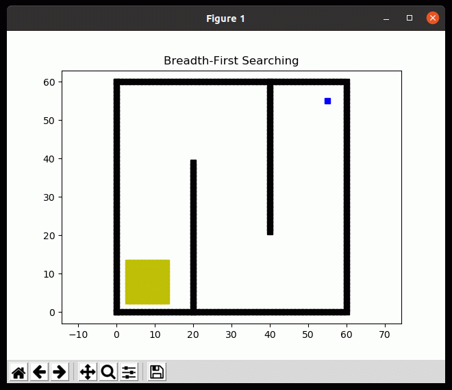
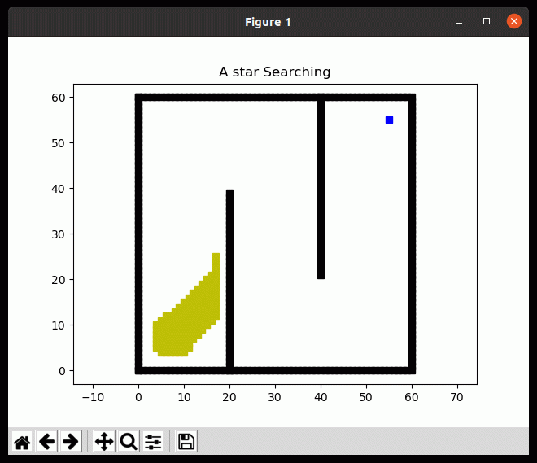

# Path planning

This repository implements some common path planning algorithms used in robotics. It will be continuously updated.

## 1. Graph Search base algorithms

### 1.1 BFS

### 1.2 DFS

complicated path, useless.

### 1.3 Dijkstra

In this scene, the cost of the edge is same. So the method of Dijkstra is equal to the BFS.

### 1.4 A*

### 1.5 D*

## 2. Papers

* [A*: ](https://ieeexplore.ieee.org/document/4082128) A Formal Basis for the heuristic Determination of Minimum Cost Paths

## 3. Dependencies

- Eigen
- [matplotlib in c++](https://github.com/lava/matplotlib-cpp)

## 4. Trouble Shooting

matplotlib in c++ can plot but can not save the gif  figure.
